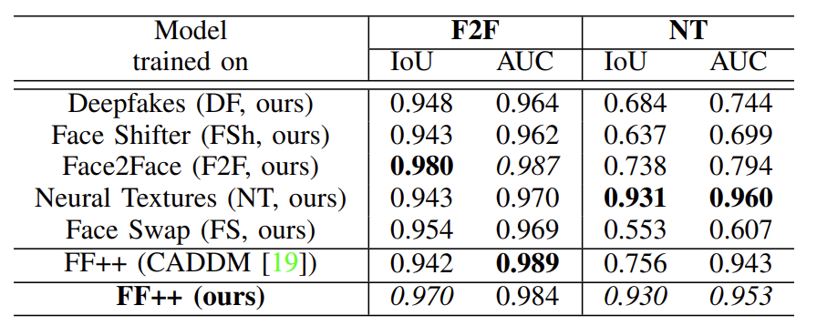
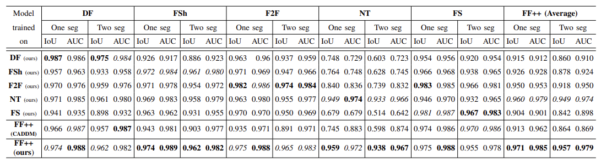

# Undercover Deepfakes: Detecting Fake Segments in Videos

Accepted at [DFAD Workshop](https://ailb-web.ing.unimore.it/dfad2023/) in ICCV 2023: [[arXiv](https://arxiv.org/abs/2305.06564) | [pdf](https://openaccess.thecvf.com/content/ICCV2023W/DFAD/papers/Saha_Undercover_Deepfakes_Detecting_Fake_Segments_in_Videos_ICCVW_2023_paper.pdf)]

<!--  -->


## Evaluate on Temporal Deepfakes
1. Download the trained timeseries transformer model from [here](https://drive.google.com/drive/folders/1SNY-gIHY9QJigcYDR2115n7snv17W6nU?usp=sharing).
2. Also download the preprocessed data from [here](https://drive.google.com/drive/folders/1o1Z6l2Icrn2KV8SfieSHYBnSlnoewHpz?usp=sharing). Please note, this data are the _preprocessed_ **ViT-embeddings**, not raw images.
3. Run the script `evaluate.py` like below:
```shell
python evaluate.py --model </path/to>/model/temporal_dfd.h5 --data </path/to>/embeddings/subtle/ --variation subtle
```
There are three types of embeddings: `subtle` for videos with carefully selected fake segments, `random` (TBA) for videos with randomly selected fake segments, and `video` (TBA) for videos that have same type of frames throughout i.e. they do not have a mix of `real` and `fake` frames.

Use the argument `--data` and `--variation` accordingly i.e. if you change `--data` to the `random` directory, also change `--variation` to `random`. 
## ViT Model Weights
Fine-tuned ViT model weights can be found [here](https://mediaflux.researchsoftware.unimelb.edu.au:443/mflux/share.mfjp?_token=kMEoAeb6PUsHySXx7Ogw11282382393&browser=true&filename=checkpoint_best.pth.tar). 
ViT-embeddings for FF+ dataset can be downloaded [here](https://mediaflux.researchsoftware.unimelb.edu.au:443/mflux/share.mfjp?_token=TH4gLTKIH4bbwNECwkug11282382497&browser=true&filename=ff%2B_2_class_emb.zip).

We also thank the authors of the [SSF](https://github.com/dongzelian/SSF) for providing their source code.


## Abstract
The recent renaissance in generative models, driven primarily by the advent of diffusion models and iterative improvement in GAN methods, has enabled many creative applications. However, each advancement is also accompanied by a rise in the potential for misuse. In the arena of the deepfake generation, this is a key societal issue. In particular, the ability to modify segments of videos using such generative techniques creates a new paradigm of deepfakes which are mostly real videos altered slightly to distort the truth. This paradigm has been under-explored by the current deepfake detection methods in the academic literature. In this paper, we present a deepfake detection method that can address this issue by performing deepfake prediction at the frame and video levels. To facilitate testing our method, we prepared a new benchmark dataset where videos have both real and fake frame sequences with very subtle transitions. We provide a benchmark on the proposed dataset with our detection method which utilizes the Vision Transformer based on Scaling and Shifting to learn spatial features, and a Timeseries Transformer to learn temporal features of the videos to help facilitate the interpretation of possible deepfakes. Extensive experiments on a variety of deepfake generation methods show excellent results by the proposed method on temporal segmentation and classical video-level predictions as well. In particular, the paradigm we address will form a powerful tool for the moderation of deepfakes, where human oversight can be better targeted to the parts of videos suspected of being deepfakes.


## Temporal Dataset
Temporal dataset is prepared based on the FaceForensics++ (FF++) dataset. We publish the start and end frame number of the fake segment(s) in the CSV files in [temporal_dataset](temporal_dataset/) folder.
<!--  -->

Manually selected fake segments where transition from real to fake frames and vice versa are very subtle.

## Model Architecture

We leverage Parameter Efficient Fine-Tuning (PEFT) to build an efficient transformer-based architecture that achieves results comparable to and outperforming SOTA methods.
<!--  -->


## Results
### Temporal Segmentation
<!--  -->

On the subset with subtle transitions between real and fake frames.


<!--  -->

On the subset with random (not subtle) transitions between real and fake frames.


### Video Level Classification
<!--  -->


## Cite this paper
    @InProceedings{Saha_2023_ICCV,
    author    = {Saha, Sanjay and Perera, Rashindrie and Seneviratne, Sachith and Malepathirana, Tamasha and Rasnayaka, Sanka and Geethika, Deshani and Sim, Terence and Halgamuge, Saman},
    title     = {Undercover Deepfakes: Detecting Fake Segments in Videos},
    booktitle = {Proceedings of the IEEE/CVF International Conference on Computer Vision (ICCV) Workshops},
    month     = {October},
    year      = {2023},
    pages     = {415-425}
}
